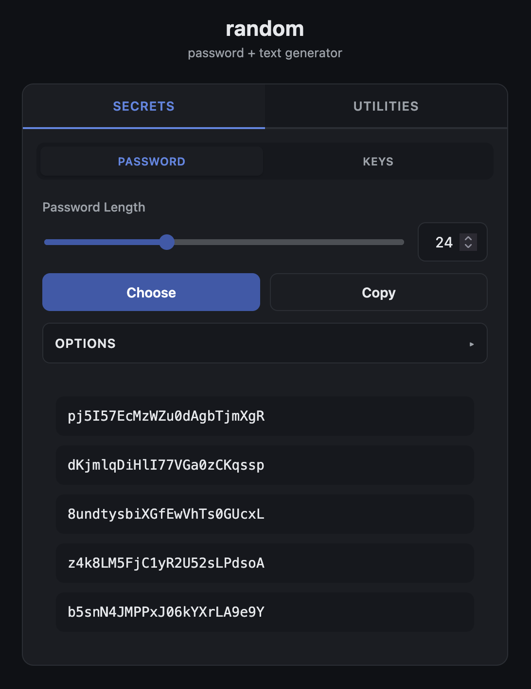

# random

[](https://github.com/ste-haus/random/actions/workflows/build-image.yml)
[](https://github.com/ste-haus/random/pkgs/container/random)


[](LICENSE)

### [Try it live →](https://random.ncc.cx)

Passwords, passphrases, SSH keys, UUIDs, hashes, dice rolls, and lorem ipsum, all generated in your browser from a single HTML file. No backend, no build step, no dependencies; just `index.html` and a bundled wordlist. Every random value comes from the Web Crypto API (`crypto.getRandomValues` / `crypto.randomUUID`), never `Math.random`.



## Features

- **Two tabs, Secrets and Utilities**, in one card that follows the OS `prefers-color-scheme` for dark and light. Secrets holds Password and Keys; Utilities holds Text, Numbers, Lorem, and Hash.
- **Password tab**
  - **Length** slider (4–64) paired with a number box.
  - **Choose** generates five options; click any one to copy it.
  - **Copy** puts a fresh password straight on the clipboard.
  - **Options**: uppercase, numbers, special characters, and exclusions for similar (`Il1O0`), vowels, and ambiguous (`{}[]()/\'"~,;:.<>`) characters.
  - **Correct Horse Battery Staple** is passphrase mode. Selecting it switches the length to a word count, locks the other options, and builds passphrases from random dictionary words.
- **Text tab**
  - **IDs**: UUID (v4), ULID (sortable, Crockford base32), MAC (random 6-byte).
  - **Encodings**: Base64URL, raw bytes (space-separated decimals), and hex, each `N` units long from the length slider.
  - Output slides in; click it to copy.

## Passphrase wordlist

Passphrase mode reads `words.txt`, fetched from the same origin on page load. The bundled list is **14,129 unique words** (3–9 letters), merged and deduplicated from three sources:

| Source | Purpose |
|--------|---------|
| [google-10000-english](https://github.com/first20hours/google-10000-english) (no-swears) | Common, memorable words |
| [EFF Large Wordlist](https://www.eff.org/dice) | Curated for passphrases (distinct prefixes, edit distance ≥ 3) |
| [BIP-39 English](https://github.com/bitcoin/bips/blob/master/bip-0039/bip-0039-wordlists.md) | Clean crypto seed-phrase list |

That is ≈13.8 bits per word: a 4-word passphrase carries ≈55 bits, a 6-word one ≈83. Use five or more for anything that matters. Lengthening the passphrase beats expanding the wordlist; each extra word in the passphrase adds ~13.8 bits, while doubling the wordlist adds only 1 bit per word.

## Running it yourself

[random.ncc.cx](https://random.ncc.cx) serves exactly the files in this repo, so hosting your own copy is only worth it if you want it on your own network, or pinned to a version. Three ways to do it, easiest first.

**From the published image.** The site packaged as static Nginx (`nginx:1.27-alpine`) serving `index.html`, `words.txt`, and `lorem.txt`; see `Dockerfile`.

```bash
docker run -p 8080:80 ghcr.io/ste-haus/random:latest
# then open http://localhost:8080/
```

**From source.**

```bash
docker build -t random .
docker run -p 8080:80 random
```

**Straight from the filesystem.** Opening `index.html` in any modern browser runs the character generator and every text tool with no server at all. Passphrase mode is the one exception: it fetches `words.txt`, and browsers block `fetch` over `file://`. Serve the directory over HTTP to use it.

```bash
python3 -m http.server 8799
# then open http://localhost:8799/
```

## License

MIT; see [LICENSE](LICENSE).
